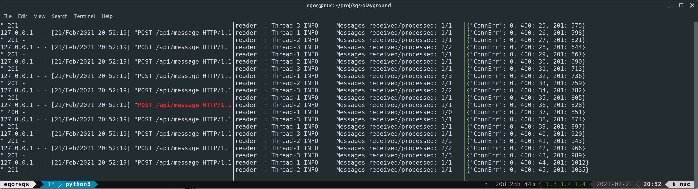

# Trivial service utilizing SQS

## Prerequisites 

- minimal: `python3`, `pip3`, `boto3` installed and configured
- recommended: `venv`, `Make`, and `tmux`

Setup instructions assume you have everything installed.

## Setup and first run

1. Make sure you have boto3 installed and configured. The user must have enough rights to create SQS queues. See instructions [here](https://boto3.amazonaws.com/v1/documentation/api/latest/guide/configuration.html)
2. Clone this project
3. `make setup` will create python virtual environment, install dependencies, and setup SQS queues.
4. `make run` to launch service and the test client



Three panes from left to right: HTTP service logs, queue-reader stats, and test client stats.

**Note**: The client purposefully sends one malformed request per batch (see 400s counter). Moreover, message processor purposefully configured to fail in ~10% of cases for illustration and testing purposes (see discrepancy in received/processed messages).

To run components separately don't forget to activate virtualenv by executing `. .venv/bin/activate`

To run tests execute `make test`

## Files

Component | File | Description
------------- | ------------- | -------------
Queue-writer | server.py | Simple Flask+connexion server. Provides REST endpoint to enqueue messages
Queue-writer | message.py | Handlers for /message REST calls. Writes messages to the queue
Queue-writer | swagger.yml | OpenAPI definition
Queue-reader | worker.py | Reads and processes messages from the queue
Shared | sqsinterface.py | Simple interface to AWS SQS
Shared | config.py | Global configuration file
Shared | log.conf | Local loggers configuration
Setup and test | client.py | Simple client to generate load
Setup and test | sqs_setup.py | Initial setup helper
Setup and test | runall.sh | Helper to run Client, Writer and Reader components


## Exposed API endpoint

Please also see `swagger.yml`

HTTP request | Description | Parameters |
------------- | ------------- | -------------
**POST** /api/message | Sends message to the queue | Name: **body** [required]<br /> Type: **str**<br /> Example: {'body': 'This is a test message to enqueue'}

### Return codes

Code | Descritpion
------------- | -------------
201 | Message enqueued successfully
400 | Message enqueue failed due to missed parameter or malformed request
500 | Message enqueue failed due to service-side error


### Return type

application/json

### Authorization

No authorization required

### HTTP request headers

 - **Content-Type**: application/json
 - **Accept**: application/json

### Minimal example
```python
import requests

payload = {'body': 'This is a test message to enqueue'}
r = requests.post("http://127.0.0.1:5000/api/message", json=payload)
print(r.status_code)
```
